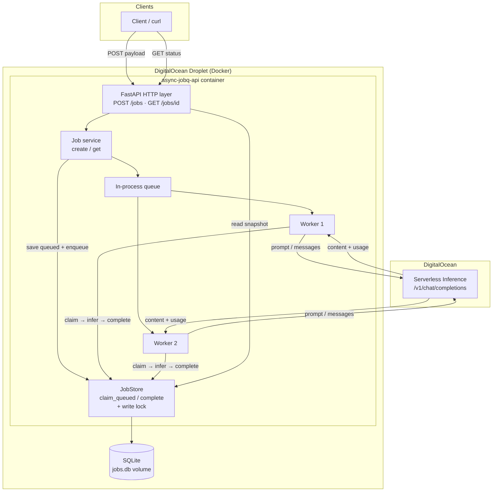

# Job Queue API

FastAPI async job queue with SQLite storage, in-process workers, and DigitalOcean Serverless Inference.

## Architecture



### Steps (match the diagram)

1. **Client → API** — `POST /jobs` with a prompt/payload  
2. **API → Job service** — validate body, create job id  
3. **Service → JobStore / SQLite** — persist job as `queued` (committed before return)  
4. **Service → Queue** — enqueue `job_id`; HTTP returns `202` + id immediately  
5. **Queue → Worker** — one of the 2 workers pulls the id  
6. **Worker → JobStore** — atomic `claim_queued` (`queued` → `running`)  
7. **Worker → DigitalOcean Inference** — call `/v1/chat/completions`  
8. **Inference → Worker** — model returns content + usage  
9. **Worker → JobStore** — atomic `complete` (`running` → `succeeded`/`failed` + result)  
10. **Client → API** — `GET /jobs/{id}` reads the latest committed snapshot from SQLite  

## Layout

```
app/
  main.py                 # FastAPI app, loads .env, starts worker pool
  db.py                   # engine, session, init_db
  routes/jobs.py          # HTTP endpoints
  services/jobs.py        # create/get + enqueue
  models/job.py           # Pydantic schemas
  models/orm.py           # SQLAlchemy JobRecord
  store/jobs.py           # persistence
  workers/pool.py         # queue + worker threads
  workers/inference.py    # DigitalOcean LLM client
Dockerfile
docker-compose.yml        # Droplet deploy (API + workers in one container)
```

## Setup

```bash
cd async-jobQ
python -m venv .venv
source .venv/bin/activate
pip install -r requirements.txt
cp .env.example .env   # then put your DO model access key in .env
```

## Run (local)

```bash
uvicorn app.main:app --reload --host 0.0.0.0 --port 8000
```

## Tests

```bash
pip install -r requirements.txt
PYTHONPATH=. pytest -q
```

## Deploy to DigitalOcean Droplet (Docker + SQLite)

API and workers run in **one container**. SQLite is stored on a Docker volume so data survives restarts.

### 1. Create a Droplet
- Image: **Ubuntu 22.04/24.04**
- Size: basic (1GB+ RAM is fine to start)
- Add your SSH key
- Optionally enable a firewall and allow ports **22** and **8000**

### 2. SSH in and install Docker
```bash
ssh root@YOUR_DROPLET_IP
# copy scripts/setup-droplet.sh to the droplet, then:
bash scripts/setup-droplet.sh
```

### 3. Get the code onto the Droplet
```bash
git clone https://github.com/Kartikey2510/async-jobQ.git
cd async-jobQ/async-jobQ
```

### 4. Configure secrets
```bash
cp .env.example .env
nano .env   # set DO_MODEL_ACCESS_KEY and DO_INFERENCE_MODEL
```

### 5. Start
```bash
docker compose up -d --build
docker compose logs -f
```

### 6. Smoke test
```bash
curl -s -X POST http://YOUR_DROPLET_IP:8000/jobs \
  -H 'Content-Type: application/json' \
  -d '{"prompt": "Say hello in one sentence"}'

curl -s http://YOUR_DROPLET_IP:8000/jobs/JOB_ID
# Docs: http://YOUR_DROPLET_IP:8000/docs
```

### Useful commands
```bash
docker compose ps
docker compose logs -f api
docker compose restart
docker compose down          # stop (keeps SQLite volume)
docker volume ls             # jobdata volume holds jobs.db
```

## Endpoints

| Method | Path | Description |
|--------|------|-------------|
| `POST` | `/jobs` | Create a job (202). |
| `GET` | `/jobs/{job_id}` | Fetch status / result. |

### Example

```bash
curl -s -X POST http://localhost:8000/jobs \
  -H 'Content-Type: application/json' \
  -d '{"prompt": "Say hello in one sentence"}'

curl -s http://localhost:8000/jobs/JOB_ID
```
